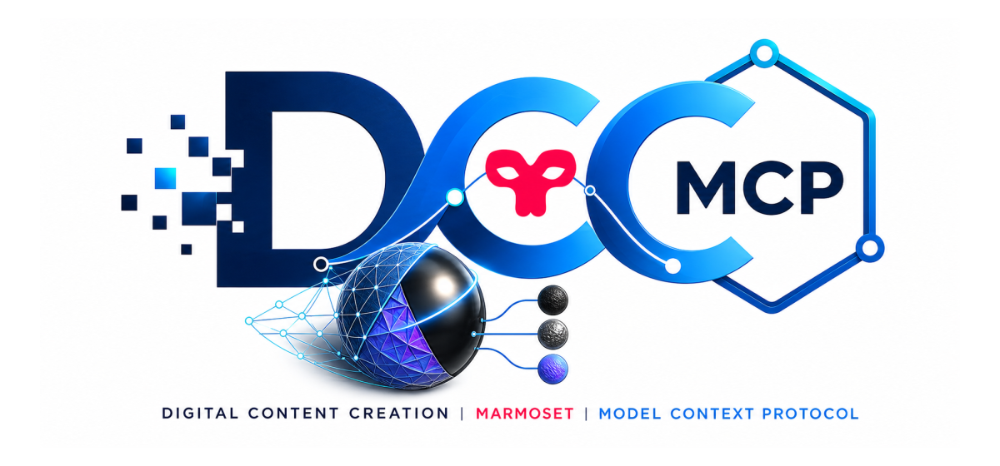

# dcc-mcp-marmoset

<p align="center">
  
</p>

Typed DCC-MCP control for Marmoset Toolbag 4.03+ and 5.x. A pure-Python
Toolbag plugin executes `mset` calls on `mset.callbacks.onPeriodicUpdate`; an
external `DccServerBase` process owns MCP, discovery, jobs, and gateway
registration.

## Install

```powershell
python -m pip install dcc-mcp-marmoset
```

In Toolbag, choose **Edit > Plugins > Show User Plugin Folder**, copy that
folder path, then run:

```powershell
dcc-mcp-marmoset-install --plugin-dir "C:\path\shown\by\Toolbag"
```

Choose **Edit > Plugins > Refresh**, then launch **dcc_mcp_marmoset**. The
plugin starts one host-bound adapter process per Toolbag process; relaunching
the plugin reuses that runtime. Toolbag requires one visible plugin window to
keep callbacks alive, so the adapter uses a single compact `DCC-MCP` lifetime
window. Closing it stops the plugin. See [install.md](install.md) for details.

## Agent workflow

Shell-capable agents use the shared CLI:

```powershell
dcc-mcp-cli list
dcc-mcp-cli search --query "inspect Toolbag scene" --dcc-type marmoset
dcc-mcp-cli load-skill marmoset-scene --dcc-type marmoset
dcc-mcp-cli search --query "inspect Toolbag scene" --dcc-type marmoset
dcc-mcp-cli describe <tool-slug>
dcc-mcp-cli call <tool-slug> --json '{"max_objects":500}'
```

Use the exact slugs returned by `search`. IDE-only clients may connect to the
gateway MCP endpoint at `http://127.0.0.1:9765/mcp`.

## Typed tools

- `marmoset_scene__ping`
- `marmoset_scene__inspect_scene`
- `marmoset_scene__import_model`
- `marmoset_scene__create_pbr_material`
- `marmoset_scene__set_visibility`
- `marmoset_scene__save_scene`
- `marmoset_scene__render_camera`

The adapter deliberately exposes no arbitrary Python execution. Its bridge is
loopback-only, uses a per-launch random token, caps messages at 1 MiB, and
expires queued requests before host mutation. Camera rendering is an async Core
job backed by a monolithic Toolbag render call; check job/output state before
retrying after a timeout.

## Development

```powershell
vx uv venv .venv --python 3.12
vx uv pip install --python .venv -e ".[dev]"
.venv\Scripts\python -m pytest
.venv\Scripts\python -m ruff check src tests tools
.venv\Scripts\python -m ruff format --check src tests tools
.venv\Scripts\python tools\lint_skills.py
```

The host API contract follows Marmoset's official
[Python scripting guide](https://marmoset.co/posts/python-scripting-toolbag/)
and [Toolbag 5 Python API reference](https://www.marmoset.co/python/reference5.html).
